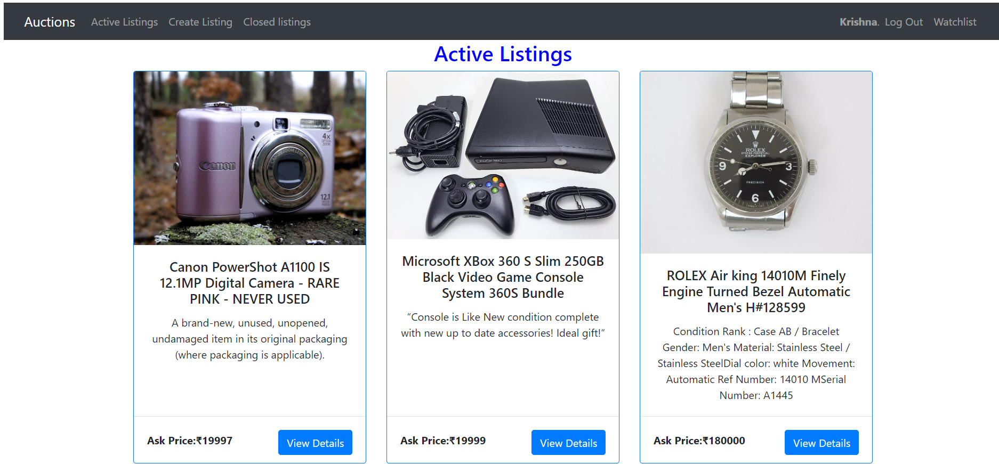
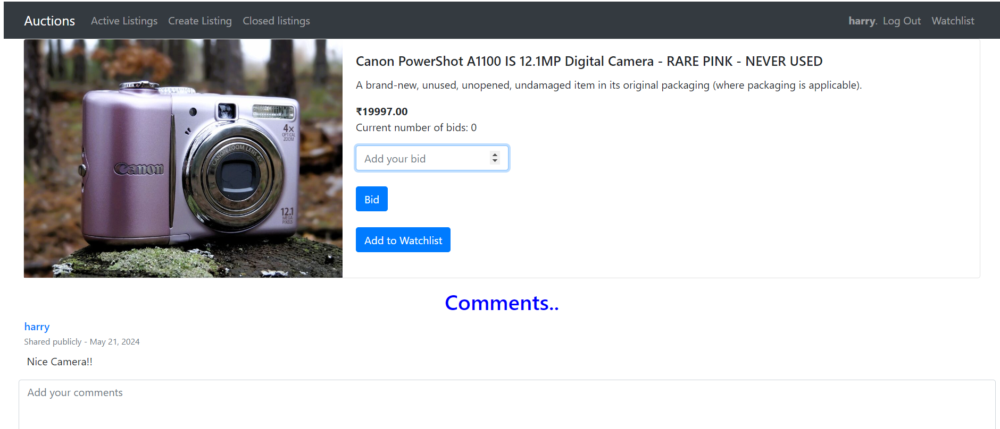
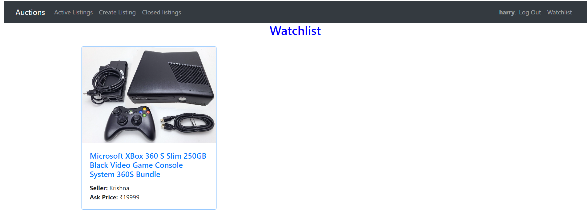
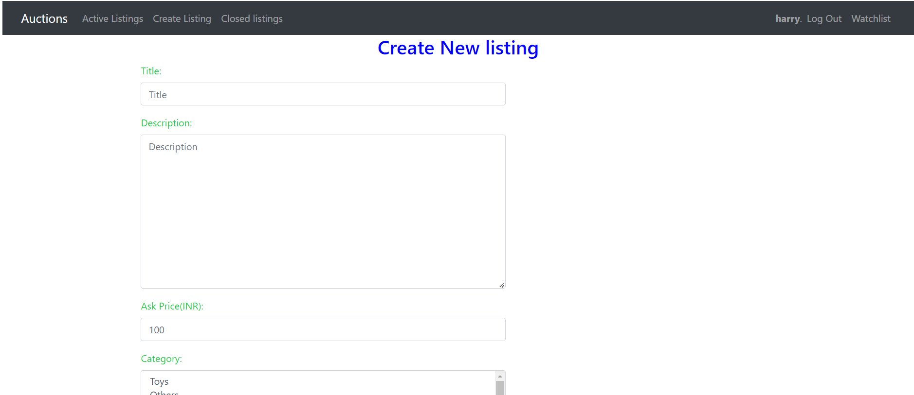
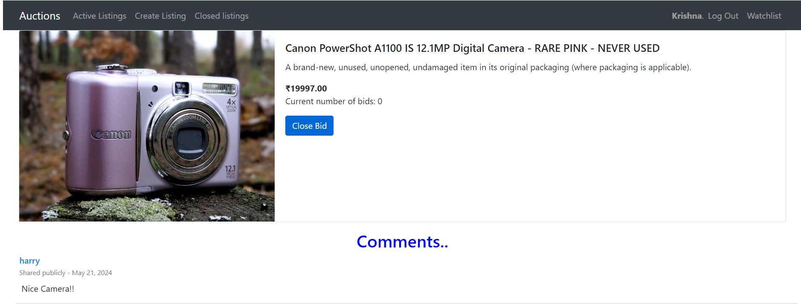
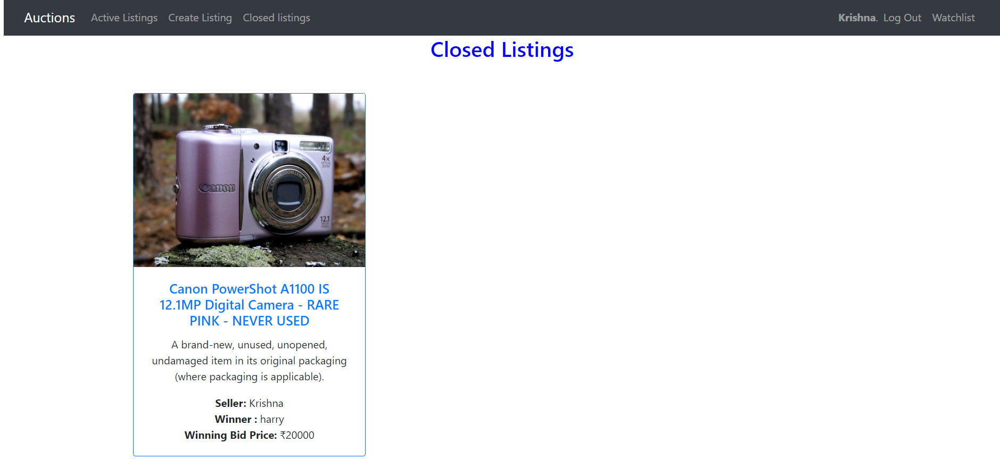

# Ecommerce Website

E-Auction
E-Auction is an online marketplace where users can list items for sale, place bids on items, and comment on listings. This project demonstrates the use of Django for web development, incorporating user authentication, database models, and dynamic content rendering.


## Features
User Authentication: Secure registration and login system.
Product Listings: Users can create and manage listings with descriptions, images, and starting bids.
Bidding System: Users can place bids on listings, with the highest bid displayed.
Watchlist: Users can add listings to their watchlist for easy access.
Comments: Users can  add thier comments on listings to interact with other users.

## Getting Started
Follow these instructions to set up the project on your local machine for development and testing purposes.

Prerequisites
Python 3.11
Django 4.1.7
SQLite (default database)

## Installation
Clone the repository:

cd E-Auction

Create a virtual environment:

```
conda create -p venv python==3.11
```
```
conda activate venv
```

source venv/bin/activate
Install dependencies:

```
pip install -r requirements.txt
```

Run database migrations:

```
python manage.py migrate
```

Create a superuser:

```
python manage.py createsuperuser
```

Run the development server:

```
python manage.py runserver
```

The application will be accessible at http://127.0.0.1:8000/.

## Usage
Home Page: To view active listings.
Create Listing: To create a new listing by providing details and a starting bid.
Bid on Listings: Place bids on active listings.
Comment: Add comments to listings.
Watchlist: Add or remove listings from your watchlist.

## Screenshots

Home page showing active listings
[media\Active.png]


Listing page with bidding and commenting features


User's watchlist page


Create new listing page


Close bidding option to the seller


Closed bidding page


### Author
Krishnakant Pal